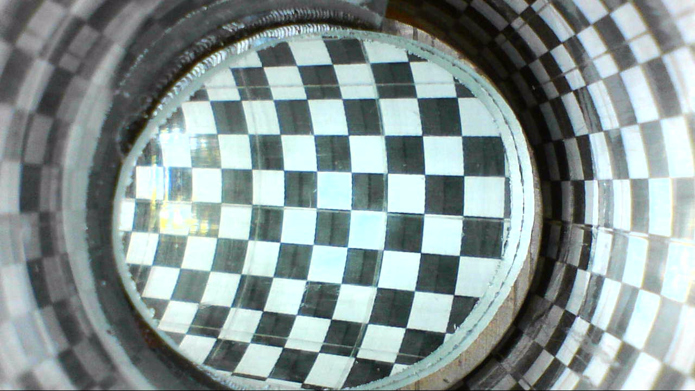

# minirhizotron-transform

This repo is used to transform images from a **minirhizotron** for areal calculations.

It relies upon the [points2gcp](https://github.com/jonnyhuck/points2gcp) script (which is bundled in this repo), and upon the excellent [GDAL](https://www.gdal.org/).

To set it up, you need to define the ground control points for your transform. To do this, simply photograph a grid wrapped around the minirhizotron and load into the **QGIS Georeferencing** tool. Add a **Ground Control Point** at each intersection using a defined grid interval (e.g. 100px) and export the resulting GCPs as `pointsfile.points`.

Then, put the images that you would like to transform (jpg format) into the root directory of the repo and run `bash warp.sh`. This will output the reansformed images into the `out/` directory.

### Example 1: Using a Calibration Grid

#### Before:

#### After

### Example 2: Using Real Data

#### Before:

#### After

You can read more about the use of a **minirhizotron** in our forthcoming paper **[coming soon...]**.